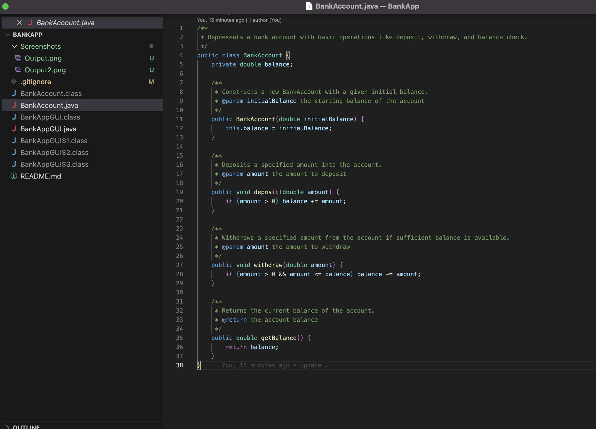
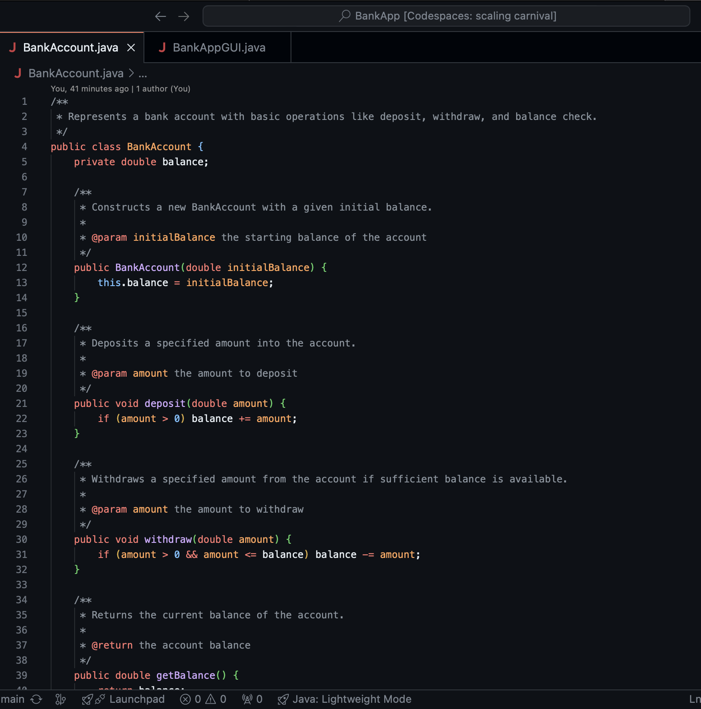
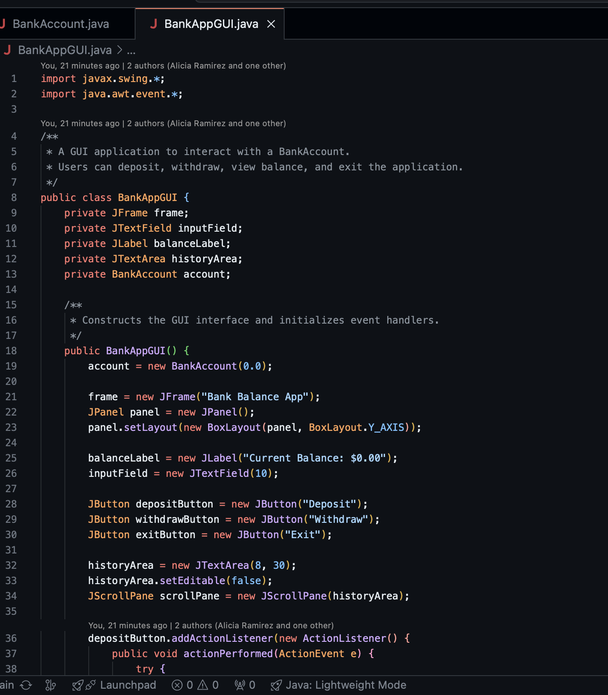
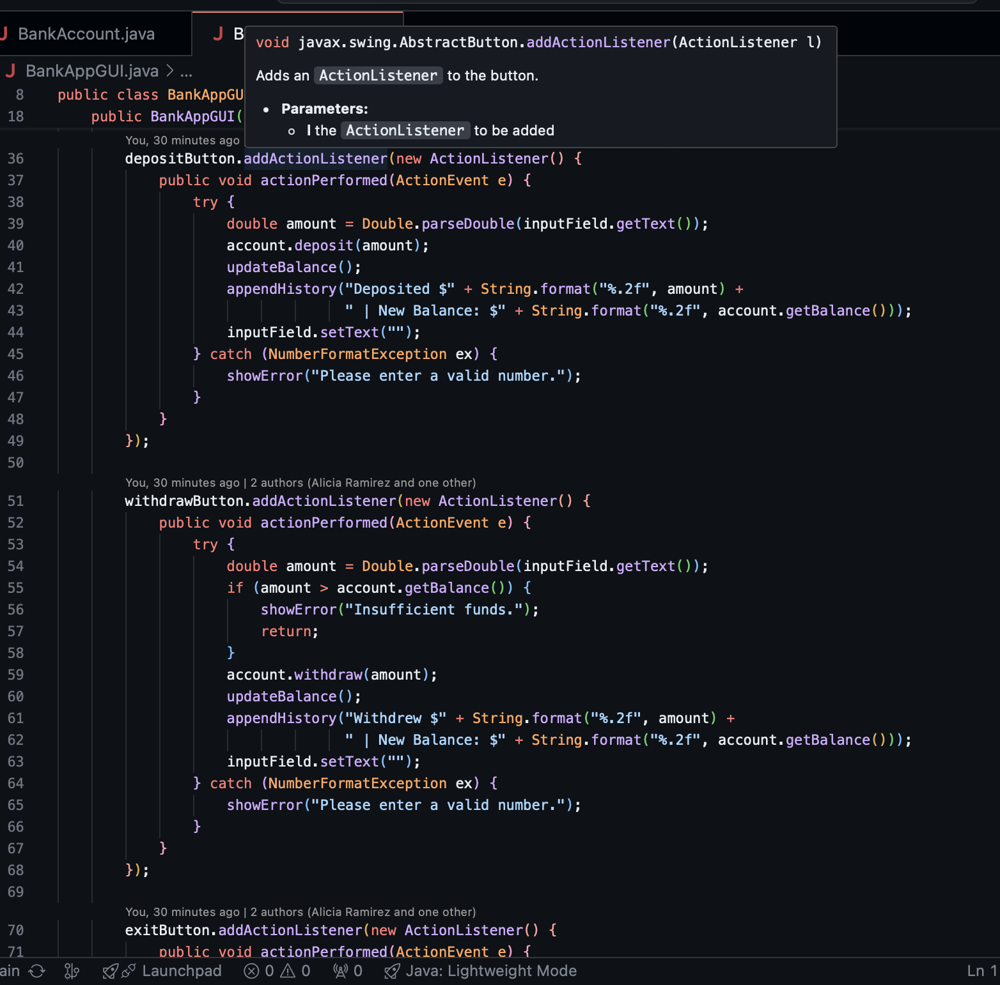
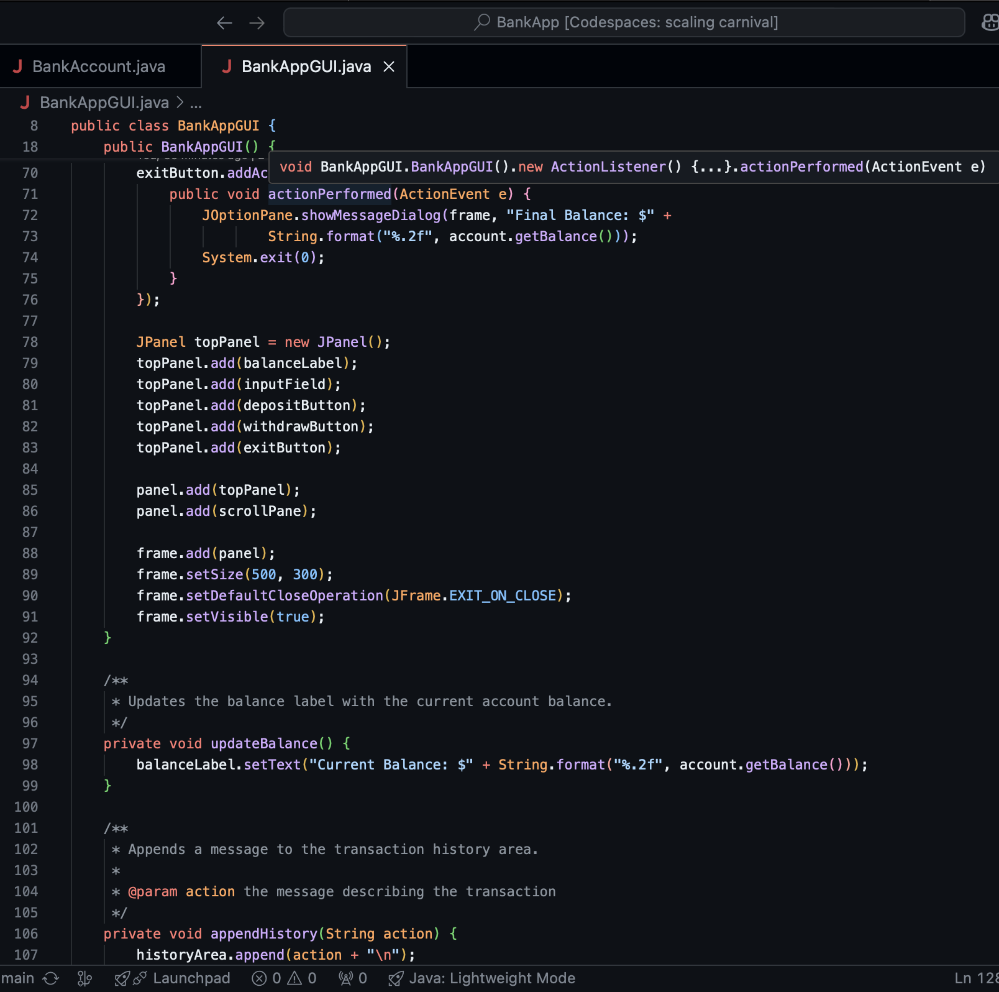
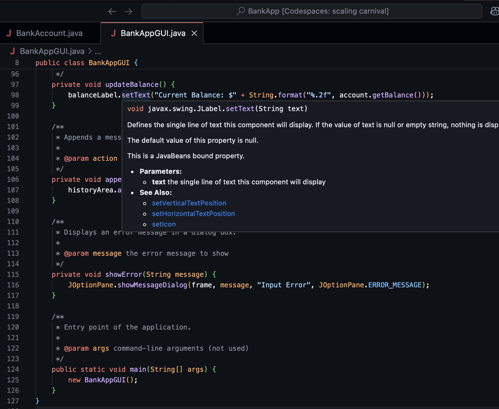
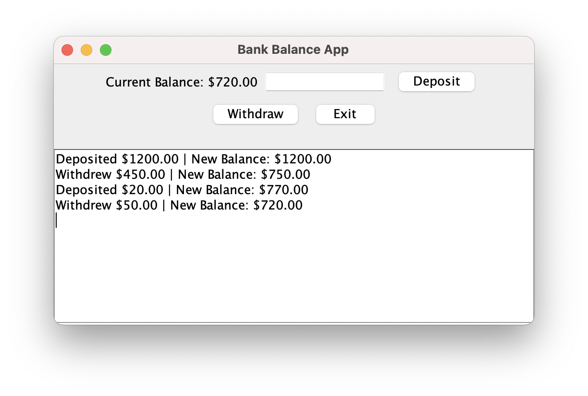
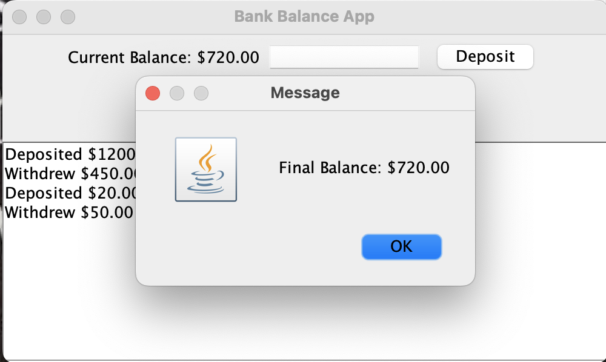
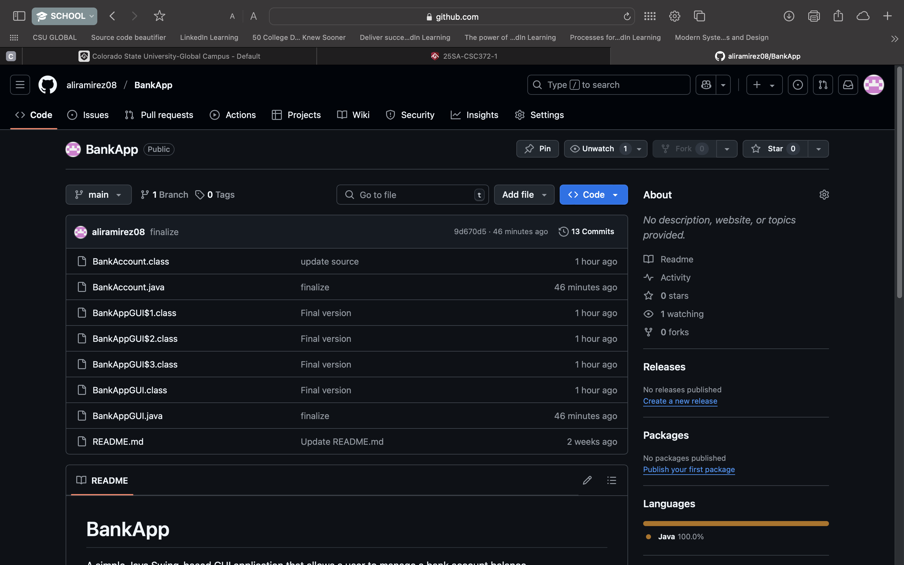

# BankApp

A simple Java Swing-based GUI application that allows a user to manage a bank account balance.

## Features

- View current balance
- Deposit funds
- Withdraw funds (with overdraft protection)
- Transaction history displayed in real-time
- Final balance shown on exit

## Technologies Used

- Java (JDK 17+)
- Java Swing (for GUI)
- Git & GitHub (for version control)


---

## Features

- View current balance
-  Deposit funds
-  Withdraw funds (with overdraft protection)
-  Real-time transaction history
-  Final balance displayed on exit


## Technologies Used

- **Java** (JDK 17+)
- **Java Swing** (for GUI)
- **Git & GitHub** (for version control)


##  Screenshots

###  BankAccount Source Code




###  BankAppGUI Source Code






###  Program Output



---

###  GitHub Repository


---

##  How to Run

1. Clone or download this repository.
2. Compile the source files:

   ```bash
   javac BankAppGUI.java BankAccount.java
   ```
3. Run the application:
   ```bash
   java BankAppGUI
   ```
The GUI will launch, allowing you to interact with your virtual account.
