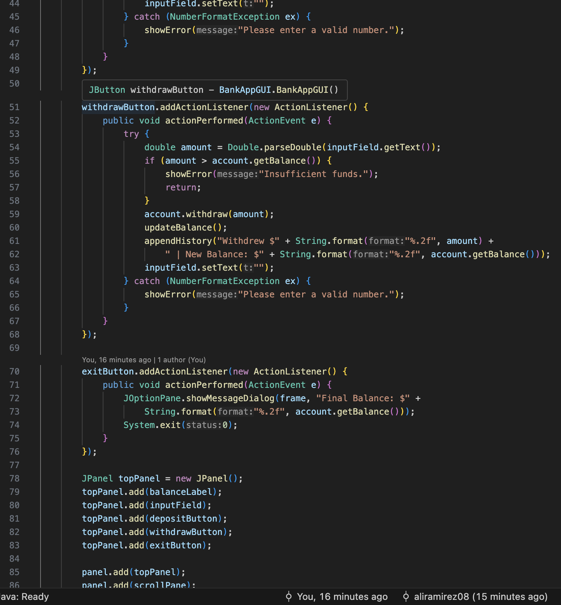
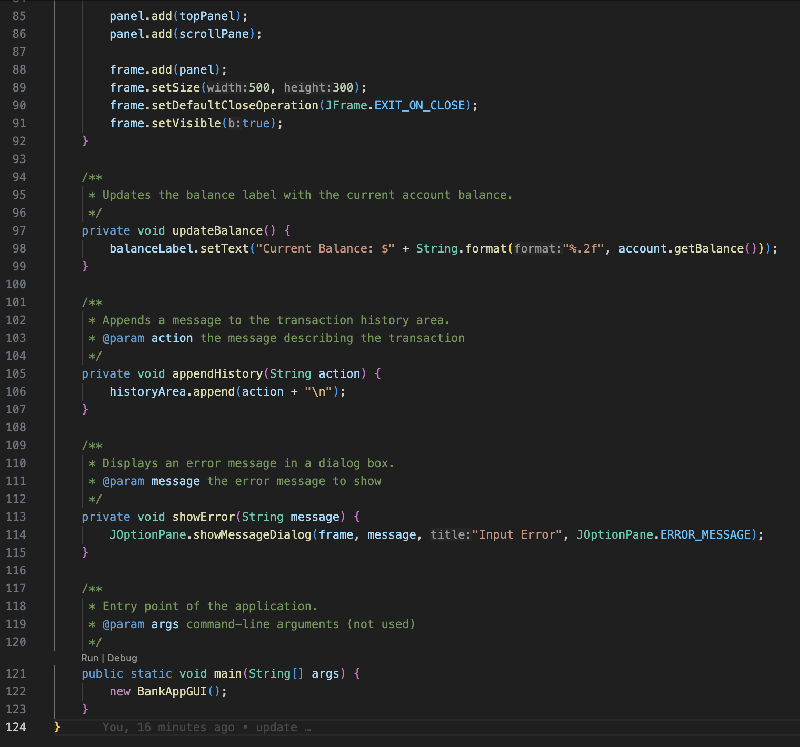

# BankApp

A simple Java Swing-based GUI application for managing a bank account. Users can deposit, withdraw, and view balance updates in real-time.

## Features
- Deposit and withdraw money
- Live balance display
- Transaction history
- Final balance alert on exit

---

## Screenshots

### Account Logic


### GUI Setup




### App Output


---

## How to Run

```bash
javac BankAccount.java BankAppGUI.java
java BankAppGUI

